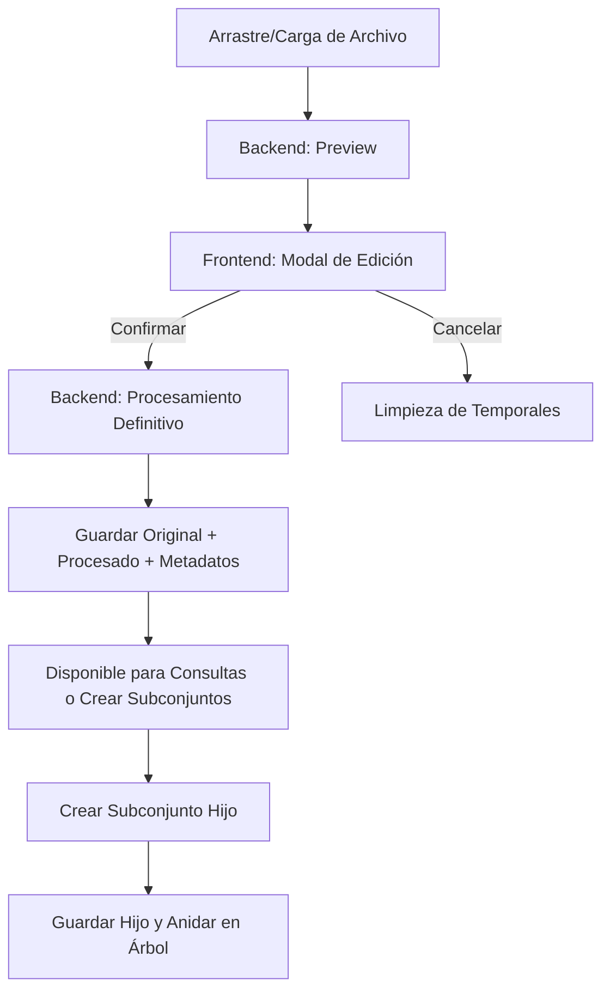

---

# 📄 Documentación y Plan de Desarrollo: Procesamiento y Gestión de Archivos

---

## 1. Flujo Actual: Subida, Previsualización y Procesamiento de Archivos

### 1.1. Subida y Asignación de Nombre
1. El usuario selecciona un archivo y asigna un nombre en el modal de subida (`file-name-input`).
2. El frontend construye un `FormData` con el archivo, la configuración de columnas y el nombre asignado.
3. El FormData se envía al backend (`/process_file` o `/upload`).
4. El backend recibe el nombre y lo guarda en los metadatos del archivo procesado.
5. Al listar archivos, el backend devuelve el nombre correcto y el frontend lo muestra en la UI.

### 1.2. Previsualización y Edición Interactiva
- El usuario ve una preview (cabeceras, tipos, primeras filas) tras subir el archivo.
- Puede quitar columnas, renombrarlas y cambiar su tipo antes de procesar.
- El frontend valida en tiempo real y muestra feedback visual inmediato:
    - Errores de tipo (celda resaltada en rojo, mensaje claro).
    - Advertencia al deshabilitar columnas: “Cuidado: deshabilitar una columna durante el procesamiento es definitivo y no se puede deshacer.”

### 1.3. Procesamiento y Guardado
- Al confirmar, se envía la configuración final al backend (`/api/process_file`).
- El backend aplica los cambios, valida tipos, normaliza nombres y guarda solo el archivo procesado (no el original).
- Se devuelven metadatos y file_id del archivo procesado.

---

## 2. Requisitos y Reglas de Negocio

### 2.1. Tipos Permitidos
- Solo tipos estándar de pandas: `int`, `float`, `str`, `bool`, `datetime`, `object`.

### 2.2. Feedback Visual y Validaciones
- Errores de conversión de tipo: celda resaltada en rojo y mensaje claro.
- Advertencia al deshabilitar columnas: irreversible.

### 2.3. Guardado y Normalización
- Nunca se guarda el archivo original, solo el procesado según la configuración final.
- Los subconjuntos hijos siempre parten del archivo procesado.
- Todos los nombres de columna se guardan en minúsculas y sin acentos ni caracteres especiales.

### 2.4. Backend y Código
- Código abstracto y mantenible: separar validación, transformación, guardado, etc.
- Evitar funciones largas y monolíticas.

---

## 3. Plan de Desarrollo y Próximos Pasos

### 3.1. Fases
1. **Preprocesamiento Interactivo**
    - Endpoint `/api/preview_file` y modal editable para nombres/tipos de columnas.
2. **Procesamiento Definitivo**
    - Endpoint `/api/process_file`, guardar original, procesado y metadatos.
3. **Subconjuntos Jerárquicos**
    - Endpoint `/api/create_subset`, validación de reglas, vista en árbol.
4. **Migración a Parquet**
    - Sustituir `.pkl` por `.parquet`.
5. **Optimización UX/UI**
    - Mejorar visualización, advertencias y ayuda.
6. **Refactorización y Documentación**
    - Limpieza de código y actualización de docs.

### 3.2. Checklist Técnico
- Backend: modelos Pydantic, endpoints, validaciones, soporte Parquet.
- Frontend: modal editable, validaciones UI, selector de columnas, vista en árbol.
- Storage: guardar original + procesado + metadatos, estructura JSON clara, control de integridad.
- Testing: probar endpoints, validar errores, performance con archivos grandes.

---

## 4. Gestión Jerárquica de Archivos (Padre → Hijos)

- Archivos procesados actúan como padres.
- Se pueden crear subconjuntos hijos con columnas reducidas.
- Reglas:
    - No duplicar subconjuntos idénticos.
    - No crear un hijo con todas las columnas del padre.
    - No borrar un padre si tiene hijos.
- Árbol jerárquico visual en frontend.

---

## 5. Flujo Visual y Estructura de Metadatos

---

## 6. Reglas de Negocio Clave

- ❌ No borrar un padre con hijos.
- ✅ Se pueden eliminar hijos sin afectar al resto.
- ❌ No hijos con todas las columnas del padre.
- ✅ El árbol debe mantenerse consistente.
- ✅ `file_id` siempre único.

---

## 7. Resumen de Beneficios

- Datos limpios y trazables.
- Subconjuntos sin duplicación innecesaria.
- Consultas eficientes con Parquet.

---

# 📄 Plan de Desarrollo – Procesamiento y Gestión Jerárquica de Archivos

## 🎯 Objetivo General
Desarrollar un sistema robusto para carga, preprocesamiento y gestión de archivos con soporte para **subconjuntos jerárquicos**, asegurando:
- **Integridad** de los datos originales.
- **Flexibilidad** para crear subconjuntos derivados sin perder trazabilidad.
- **Eficiencia** en almacenamiento y consultas.

---

## 🚀 Cambios Planificados en la Aplicación

### 1. Nueva lógica de carga y preprocesamiento interactivo
- Modal de preprocesamiento para:
  - Editar nombres de columnas detectadas.
  - Ver y modificar el tipo de dato de cada columna.
  - Previsualizar datos antes de confirmar.

### 2. Edición y selección dinámica de columnas
- Habilitar/deshabilitar columnas después del procesamiento inicial.
- Generación de archivos de trabajo reducidos para consultas.

### 3. Gestión Jerárquica de Archivos (Padre → Hijos)
- Archivos procesados actúan como **padres**.
- Se pueden crear **subconjuntos hijos** con:
  - Columnas reducidas.
  - Reglas:
    - No duplicar subconjuntos idénticos.
    - No crear un hijo con todas las columnas del padre.
    - No borrar un padre si tiene hijos.
- Árbol jerárquico visual en frontend.

### 4. Migración de Pickle a Parquet
- Reemplazo `.pkl` → `.parquet` para:
  - Mayor eficiencia y compatibilidad.
  - Soporte para datasets grandes.

---

## ✅ Beneficios Esperados
- Datos **limpios** y **trazables**.
- Subconjuntos sin duplicación innecesaria.
- Consultas eficientes con Parquet.

---

## 🔄 Flujo de Procesamiento y Jerarquía de Archivos

🗂️ **Estructura de Metadatos (Ejemplo)**

⚠️ **Reglas de Negocio**
- ❌ No borrar un padre con hijos.
- ✅ Se pueden eliminar hijos sin afectar al resto.
- ❌ No hijos con todas las columnas del padre.
- ✅ El árbol debe mantenerse consistente.
- ✅ `file_id` siempre único.

🛠️ **Plan de Desarrollo Iterativo**
- **Fase 1: Preprocesamiento Interactivo**
  - Implementar endpoint `/api/preview_file`.
  - Crear modal editable para nombres y tipos de columnas.
  - Validaciones básicas.
- **Fase 2: Procesamiento Definitivo**
  - Endpoint `/api/process_file`.
  - Guardar original, procesado y metadatos.
- **Fase 3: Subconjuntos Jerárquicos**
  - Endpoint `/api/create_subset`.
  - Validación de reglas de negocio.
  - Vista en árbol en frontend.
- **Fase 4: Migración a Parquet**
  - Sustituir `.pkl` por `.parquet`.
  - Validar compatibilidad y rendimiento.
- **Fase 5: Optimización UX/UI**
  - Mejorar visualización de jerarquía y tipos de datos.
  - Añadir advertencias y mensajes de ayuda.
- **Fase 6: Refactorización y Documentación**
  - Limpieza de código.
  - Actualización de documentación.

✅ **Próximos Pasos**
- Implementar `/api/preview_file` y probarlo.
- Definir esquema JSON de metadatos definitivo.
- Añadir lógica para subconjuntos y validaciones.
- Implementar visualización jerárquica en frontend.

✅ **Checklist Técnico por Módulo**
- **Backend (FastAPI)**
  - Definir modelo Pydantic para metadatos de archivos.
  - Implementar `/api/preview_file`.
  - Implementar `/api/process_file`.
  - Implementar `/api/create_subset` con validación de columnas y duplicados.
  - Implementar `/api/file_tree` para devolver jerarquía.
  - Implementar `/api/delete_file/:id` con restricciones.
  - Gestionar limpieza de temporales (`/api/cancel_upload`).
  - Añadir soporte Parquet en `file_storage.py`.
- **Frontend (UI/UX)**
  - Modal para preprocesamiento con edición de nombres y tipos.
  - Validaciones UI para tipos incompatibles y nombres duplicados.
  - Implementar selector de columnas para crear subconjuntos.
  - Vista en árbol anidada para datasets padre → hijos.
  - Interacción directa con chat según dataset seleccionado.
- **Storage & Metadatos**
  - Guardar siempre original + procesado + metadatos.
  - Definir estructura JSON clara para jerarquía de archivos.
  - Implementar control de integridad (evitar duplicados, reglas de negocio).
  - Optimizar lectura/escritura usando Parquet.
- **Testing**
  - Probar `/api/preview_file` con CSV/Excel reales.
  - Validar errores en conversión de tipos.
  - Verificar creación/eliminación de subconjuntos.
  - Testear performance con archivos grandes.

---

